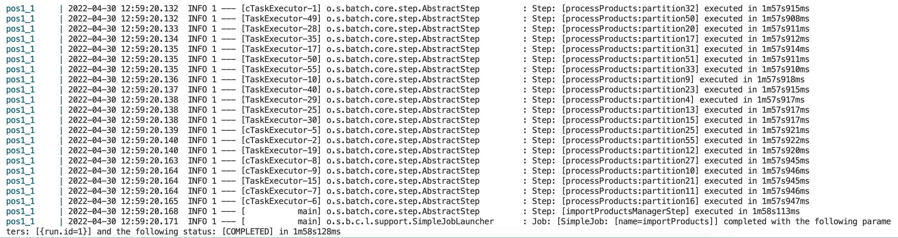
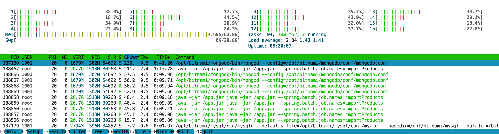
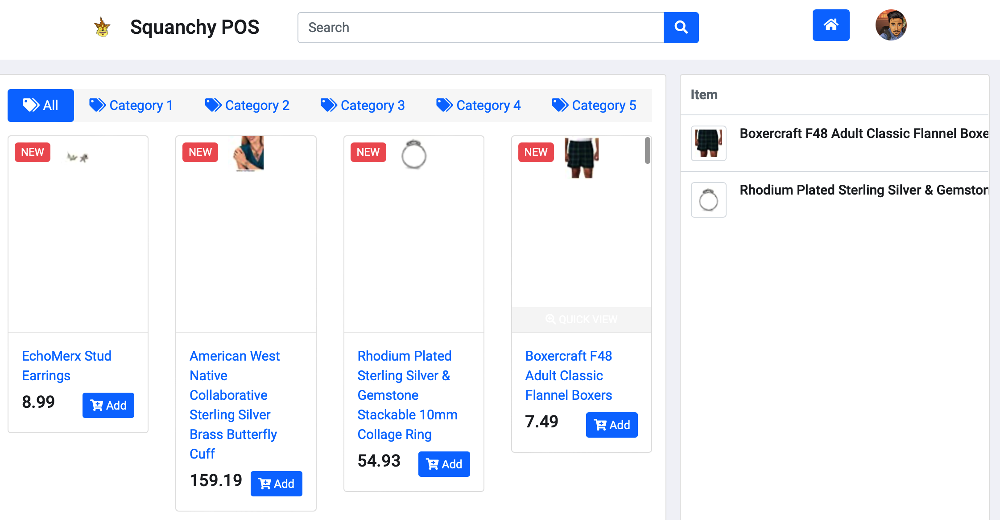

# aw06

下载了Books和Clothing Shoes and Jewelry两个数据集，总共有5620008条数据。
并将这两个数据集合并，每十万条分割为一个文件，总共得到57个块。

```
$ cat meta_Books.json meta_Clothing_Shoes_and_Jewelry.json | split -l 100000
```

将这57个块用partitioner进行分割，每一个worker负责处理导入五个块的商品信息。

具体的实现配置如下：

- 硬件配置：AMD 5800X （mac上带不动了，换成了服务器）
- 线程池：4-16线程，设置为超过2000个请求开启新线程
- 数据库：
  - Spring Batch使用MySQL保存任务信息
  - 每个线程从文件读取数据并写入MongoDB
  - MySQL和Mongo均为单实例，没有开启集群

实现中遇到的困难：

1. 需要手动解析JSON，不同数据的字段内容差异很大，特别是价格字段，有很多非数字的文本（比如`$123`、`27,000.000`、`<start...`），处理起来非常非常麻烦，写了一些简单的条件进行筛选；
2. Spring Batch的文档没有写如何配置Data Source（应该是要查询Spring文档），以前接触Spring Data都给了示范，配置Spring Batch弄了很久才搞懂；
3. 容器中运行了多个pos实例，应该配置成只需要有一个pos启动导入数据的任务即可，这个是通过`docker-compose.yml`里修改容器执行参数来实现的；

实现结果：清空所有数据库，开启`pos1`后启动导入数据任务，每一个worker负责导入五个文件，即五十万条数据，配置有16个线程并发执行，总共需要将近两分钟时间（1m58s128ms）完成。
查询Mongo得到经过对JSON筛选后，共导入了2588975条数据（字符串处理大约筛掉了一半），平均21940条每秒。
运行期间查看CPU负载可知，当前配置在导入数据时仅使用了大约50%的算力，可以通过调整任务配置的方式得到更快的效果（单节点Mongo的并发性能可能也会造成瓶颈，也需要调整）。

- Job日志：
  
- 导入数据时的系统负载：
  
- POS效果截图：
  

运行方法：进入`batch-pos`文件夹

```shell
$ docker-compose up -d redis6 mysql mongo
# 等待mysql启动并初始化（大概半分钟？）
$ mvn package
$ docker-compose up -d pos1 pos2 pos3 pos4 # 运行在8081-8084
$ docker-compose up -d haproxy             # HAProxy运行在8080
```


---

> [Amazon Review Data (2018)](https://nijianmo.github.io/amazon/index.html) has a huge products metadata set of multiple categories.
>
> |category| reviews | metadata |
> |--| -- | -- |
> |Amazon Fashion|reviews (883,636 reviews)|metadata (186,637 products)|
> |All Beauty|reviews (371,345 reviews)|metadata (32,992 products)|
> |Appliances|reviews (602,777 reviews)|metadata (30,459 products)|
> | ... |
> |Tools and Home Improvement|reviews (9,015,203 reviews)|metadata (571,982 products)|
> Toys and Games|reviews (8,201,231 reviews)|metadata (634,414 products)|
> Video Games|reviews (2,565,349 reviews)|metadata (84,893 products)|
>
> Please finish the following tasks:
>
> - Download no less than two categories of these metadata.
> - Referring the example code in this repo, convert each line in the downloaded files into a POJO of `Product` class and save the object in a database like MySQL. 
> - Integrate the database containing Amazon products with your own AW04 project and build an Amazon WebPOS system.
>
> And, of course, always try to make the system run as fast as possible.